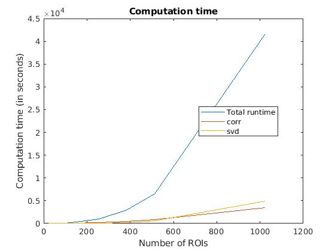

# Speeding up Connectotyping

## Profiling results

Profiling results are contained in 
[rois_versus_time.csv](./rois_versus_time.csv).  When the number of ROIs is less than or equal to 512, the `corr` method is 
the bottleneck; when the number of ROIs is 1024 or greater, the `svd` 
method is the bottleneck. This is also illustrated in this plot:

By using `polyfit` on the first <i>n - 1</i> values and testing `polyval`
on the <i>n</i>th value, we find that the computation time is linear in the 
number of ROIs.  Code determining this is in [*fit_runtime.m*](./fit_runtime.m).  However, this cannot be the case.  The complexity is in 
[<i>O(min(m * n^2, m^2 * n))</i>](https://mathoverflow.net/a/221216/33176).  (Our estimate that the time is linear is probably a result of our small sample size). 

The first step in optimizing the Connectotyping code is to [replace the MATLAB
calls to `svd`](https://www.mathworks.com/help/coder/ug/call-cc-code-from-matlab-code.html#mw_1395a54a-5181-430b-bbca-5f58882527d5) with calls to the [Gnu Scientific Library's (GSL) C implementation
of SVD](https://www.gnu.org/software/gsl/doc/html/linalg.html#singular-value-decomposition).

Using the GSL C version of singular value decomposition is much faster.  Testing code for MATLAB is in [test_runtime.m](test_runtime.m).  Testing code for C is in

* [project.c](../../src/c/src/project.c)
* [calculate_svd_from_file.c](../../src/c/src/calculate_svd_from_file.c)

We might also check the [Template Numerical Toolkit](https://math.nist.gov/tnt/).  Although I'm not sure that's necessary given how fast the C version is.

## Equivalence between MATLAB and GSL C svd methods

Here are the results in MATLAB for an example matrix, *M*:

    M = 
         1     0     0     0     2
         0     0     3     0     0
         0     0     0     0     0
         0     2     0     0     0

    U = 
         0    -1     0     0
        -1     0     0     0
         0     0     0    -1
         0     0    -1     0

    S = 
        3.0000         0         0         0         0
             0    2.2361         0         0         0
             0         0    2.0000         0         0
             0         0         0         0         0

    V = 
             0   -0.4472         0         0   -0.8944
             0         0   -1.0000         0         0
       -1.0000         0         0         0         0
             0         0         0    1.0000         0
             0   -0.8944         0         0    0.4472

Now let us do the same with the C svd call.  Here is the output:

    U:
    -0.000000 -0.447214  0.000000 -0.000000 
     0.000000 -0.000000 -1.000000 -0.000000 
    -1.000000 -0.000000  0.000000  0.000000 
    -0.000000 -0.000000  0.000000  1.000000 
    -0.000000 -0.894427  0.000000  0.000000 

    S:
    3.000000 2.236068 2.000000 0.000000 
    
    V:
    -0.000000 -1.000000 -0.000000 0.000000 
    -1.000000 -0.000000 -0.000000 0.000000 
    -0.000000 -0.000000 -0.000000 1.000000 
    -0.000000 -0.000000 -1.000000 0.000000 
    
We can see that we get the same singular values in both cases.
